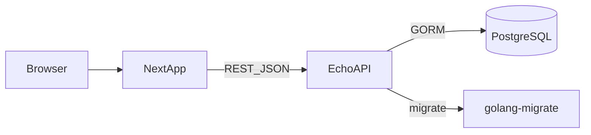

## EduMgr 实现架构（对齐 `PRD.md`）

### 1. 文档目的

本文件用于指导本课设从 0 到 1 的实现：明确**前后端边界**、**数据库模型与约束**、**API 规范**、**事务一致性策略**、以及**按 PRD 可验收的分阶段交付标准**。

### 2. 输入依据与技术选型

- 需求依据：`PRD.md`（字段、约束、查询排序、报表输出方式为验收准绳）
- 仓库说明：`README.md`
- 技术选型：
  - 前端：Next.js + Shadcn UI + TailwindCSS
  - 后端：Golang + Echo
  - ORM：GORM
  - 数据库：PostgreSQL
  - 迁移：golang-migrate
  - 认证授权：JWT + RBAC（3 角色：student / teacher / admin）
- Golang 包名：`github.com/lin-snow/edumgr`

### 3. PRD 关键需求（实现必须满足）

- **唯一性**：
  - 学生：学号唯一
  - 教职工：职工号唯一
  - 系：系号唯一
  - 课程：课程号唯一
  - 成绩：`学号 + 课程号` 联合唯一（见“学期建模与唯一键落地”）
- **选课**：
  - 每学期选课总学分 ≤ 15
  - 支持单个学生选多门；支持为多个学生选同一/多门
  - 删除选课记录需同步处理成绩数据
- **成绩查询输出规则**：
  - 查询结果包含课程基本信息 + 成绩信息
  - 涉及多门课程时：按课程分组显示
  - 每门课程内：按总评成绩从高到低排序
- **报表**：
  - 成绩登记表：学生按学号升序；可按课程号/课程名/教师姓名筛选；可按系号输出“本系所有教师担任的课程”
  - 成绩报表：在登记表基础上增加分段统计（≥90/≥80/≥70/≥60/不及格）人数及比例；筛选与排序同上

---

### 4. 总体架构

#### 4.1 责任边界

- 前端：页面与交互、表单校验、筛选排序展示、JWT 存取与路由守卫（体验级）
- 后端：业务规则与权限边界（最终裁决）、事务一致性、数据校验与约束、统计报表计算
- 数据库：主键/外键/唯一/检查约束、索引、视图（可选）以支撑查询与报表

---

### 5. 数据库设计（PostgreSQL）

#### 5.1 学期建模与 PRD“成绩联合唯一键”落地

PRD 同时提出：
- 选课规则按“**每学期**”约束（≤15 学分）
- 成绩唯一键为 `学号 + 课程号`（不包含学期）

为保持与 PRD 一致，本课设采用如下实现假设：
- **实现假设（本课设默认）**：同一学生同一课程 **最多修读一次**（不考虑重修/跨学期重修），因此 `学号 + 课程号` 作为成绩唯一键成立。
- **学期字段的用途**：学期只用于“选课学分上限”和报表筛选展示，并不参与成绩唯一键。

可扩展方案（不影响当前验收，但需在需求变更时启用）：
- 若未来要支持重修/多次修读，将成绩唯一键升级为 `学号 + 课程号 + 学期`（或引入 `course_offerings` 后改为 `student + offering`）。

#### 5.2 表与关系（建议）

> 字段命名可统一采用 snake_case；业务查询以“学号/课程号/职工号/系号”作为人类可读键，同时内部用自增/UUID 作为主键也可。

- `departments`
  - `id`（PK）
  - `dept_no`（UNIQUE，对应 PRD 系号）
  - `name`
  - `intro`
- `students`
  - `id`（PK）
  - `student_no`（UNIQUE）
  - `name`
  - `gender`
  - `birth_date`
  - `entry_score`
  - `dept_id`（FK → departments.id）
  - `status`（在读/已毕业/已转出/转入）
- `students_history`（归档库）
  - 字段与 `students` 近似，外加 `archived_at`、`archive_reason`（graduate/transfer_out）
- `staff`
  - `id`（PK）
  - `staff_no`（UNIQUE）
  - `name`
  - `gender`
  - `birth_month`
  - `dept_id`（FK → departments.id）
  - `title`（职称）
  - `major`
  - `teaching_direction`
- `courses`
  - `id`（PK）
  - `course_no`（UNIQUE）
  - `name`
  - `teacher_id`（FK → staff.id，对应 PRD 任课教师号）
  - `hours`
  - `credits`
  - `class_time`
  - `class_location`
  - `exam_time`
- `terms`
  - `id`（PK）
  - `term_code`（UNIQUE，如 2025-FALL）
  - `name`
  - `start_date` / `end_date`
- `enrollments`
  - `id`（PK）
  - `student_id`（FK → students.id）
  - `course_id`（FK → courses.id）
  - `term_id`（FK → terms.id）
  - `created_at`
  - 建议约束：
    - `UNIQUE(student_id, course_id)`（对齐 PRD：同一课程最多一次）
    - 或更保守：`UNIQUE(student_id, course_id, term_id)`（若允许不同学期重修；启用前需同步修改 grades 唯一键）
- `grades`
  - `id`（PK）
  - `student_id`（FK → students.id）
  - `course_id`（FK → courses.id）
  - `usual_score`
  - `exam_score`
  - `final_score`
  - `updated_at`
  - 约束：
    - `UNIQUE(student_id, course_id)`（对齐 PRD 的“学号 + 课程号”）
    - 分数范围 `CHECK(0 <= score AND score <= 100)`（可选但推荐）
- `users`（登录账号）
  - `id`（PK）
  - `username`（UNIQUE）
  - `password_hash`
  - `role`（student/teacher/admin）
  - `student_id`（可空，student 账号绑定）
  - `staff_id`（可空，teacher/admin 账号绑定）

#### 5.3 级联与删除策略（对齐 PRD）

- 删除系：需先校验无关联学生/教师/课程（PRD 明确要求）
- 删除教师：需先校验不再承担课程（PRD 明确要求）
- 删除选课记录：需同步处理成绩（PRD 明确要求）
  - 推荐做法：业务层显式删除 `grades`（或 grades 外键级联）并在同一事务完成

---

### 6. 后端架构（Go + Echo）

#### 6.1 分层与目录建议

- `cmd/api/`：服务启动入口
- `internal/`：
  - `handler/`：HTTP handler（参数解析、输入校验、返回 DTO）
  - `service/`：业务规则（选课学分校验、归档、权限边界、报表统计）
  - `repo/`：GORM 数据访问
  - `model/`：数据库模型
  - `middleware/`：JWT、RBAC、日志、统一错误处理
  - `pkg/`：通用工具（时间/分页/错误码等）

#### 6.2 JWT 与 RBAC

- JWT claims 最少包含：`sub(user_id)`、`role`、`exp`
- RBAC 原则（建议）：
  - `student`：仅可操作/查看本人相关数据（选课、成绩查询、个人信息）
  - `teacher`：仅可查看自己任课课程的选课学生与成绩；仅可录入/修改自己课程的成绩
  - `admin`：全量管理（学生/教师/系/课程/选课/成绩/报表）

---

### 7. 关键业务流程与事务一致性

#### 7.1 选课（学分 ≤ 15）

- 入口：创建 `enrollments`
- 事务内步骤（必须原子性）：
  - 校验 student/course/term 存在
  - 校验未重复选课（受 UNIQUE 约束保护）
  - 计算该 student 在该 term 已选课程学分总和
  - 若 `current_credits + new_course.credits > 15` 则拒绝
  - 写入 enrollment（必要时锁定 student+term 维度，防并发越界）

#### 7.2 删除选课（同步成绩）

- 同一事务内：
  - 删除 `grades(student_id, course_id)`（若存在）
  - 删除 enrollment

#### 7.3 成绩录入/修改（按课程/按学生）

- 录入/修改时校验：
  - teacher 只能修改自己任课课程的成绩
  - 分数范围合法
  - `final_score` 可由系统计算或人工录入：
    - 建议先支持人工录入（PRD 允许）
    - 可扩展：若开启自动计算，在 service 层统一规则并记录计算方式

---

### 8. API 设计（REST，建议前缀 `/api/v1`）

> 返回统一结构：`{ code, message, data }`；分页统一：`page` / `page_size`；排序统一：`sort_by` / `order`（asc/desc）。

#### 8.1 认证

- `POST /auth/login`：登录，返回 JWT
- `GET /auth/me`：返回当前用户与角色信息

#### 8.2 主数据 CRUD（与 PRD 查询条件对齐）

- Students：
  - `GET /students?student_no=&name=&dept_no=`
  - `POST /students` / `PUT /students/{id}` / `DELETE /students/{id}`
  - `POST /students/{id}/graduate`
  - `POST /students/{id}/transfer-out`
- Staff：
  - `GET /staff?staff_no=&name=&dept_no=`
  - `POST /staff` / `PUT /staff/{id}` / `DELETE /staff/{id}`
- Departments：
  - `GET /departments?dept_no=&name=`
  - `POST /departments` / `PUT /departments/{id}` / `DELETE /departments/{id}`
- Courses：
  - `GET /courses?course_no=&name=&teacher_name=`
  - `POST /courses` / `PUT /courses/{id}` / `DELETE /courses/{id}`

#### 8.3 选课

- `POST /enrollments`：
  - 支持单个学生选多门：`{ student_no, term_code, course_nos: [] }`
  - 支持多个学生选同一/多门：`{ student_nos: [], term_code, course_nos: [] }`
  - 后端逐条在事务中校验学分上限（可按 student 分批事务）
- `DELETE /enrollments/{id}`：删除选课（同步删除成绩）

#### 8.4 成绩

- `GET /grades`（对齐 PRD 查询条件）：
  - 条件：`student_no` / `student_name` / `course_no` / `course_name` / `teacher_name` / `dept_no`
  - 输出要求：
    - 若涉及多门课程：按 `course_no` 分组
    - 每组内按 `final_score desc` 排序
- `PUT /grades`（批量录入/修改）：
  - 场景 1：按课程录入：`{ course_no, items: [{ student_no, usual_score, exam_score, final_score }] }`
  - 场景 2：按学生录入：`{ student_no, items: [{ course_no, usual_score, exam_score, final_score }] }`

#### 8.5 报表

- `GET /reports/grade-roster`
  - 参数：`course_no` / `course_name` / `teacher_name` / `dept_no`
  - 排序：学生按学号升序
  - 内容：课程信息 + 选课学生名单 + 空成绩栏（或返回当前成绩可为空）
- `GET /reports/grade-report`
  - 参数同上
  - 排序同上
  - 内容：课程信息 + 学生成绩 + 分段统计（人数与比例）

---

### 9. 前端架构（Next.js）

#### 9.1 页面建议

- `/login`
- `/students`（查询/新增/编辑/归档入口）
- `/staff`
- `/departments`
- `/courses`
- `/enrollments`
- `/grades`
- `/reports`（登记表/报表）

#### 9.2 关键实现点（对齐 PRD）

- 成绩查询页面：按课程分组展示；组内总评降序
- 报表页面：支持 PRD 指定的筛选维度；登记表按学号升序；报表包含分段统计
- 权限：根据 `role` 控制菜单与路由可见性，但服务端为最终裁决

---

### 10. 迁移与初始化（golang-migrate）

- 目录：`migrations/`
- 规则：
  - 每次改表都提供 `up.sql` / `down.sql`
  - 首次迁移创建全部表/索引/约束
  - 可选迁移：插入默认管理员账号（生产环境需改密码）

---

### 11. Docker Compose 部署（建议）

- 服务：`db(Postgres)`、`backend`、`frontend`
- 环境变量：
  - `DB_DSN`（或 host/port/user/pass/dbname）
  - `JWT_SECRET`
  - `PORT`（backend）

---

### 12. 分阶段实现路线（M1-M5）与 PRD 验收清单

#### M1（骨架）验收

- 数据库迁移可执行：能创建上述核心表与关键约束（学号/职工号/系号/课程号唯一；成绩联合唯一）
- 后端 Echo 可启动；错误返回统一；日志可用
- 登录可签发 JWT；RBAC 中间件可生效（最少区分 admin/teacher/student）

#### M2（主数据 CRUD + 查询）验收

- 学生：新增/修改/删除；按学号精确查；按姓名/系号查（PRD 4.1）
- 教职工：按职工号/姓名/系号查（PRD 4.2）；删除前校验仍承担课程（PRD 3.4）
- 系：增删改查；删除前校验关联数据（PRD 3.2）
- 课程：增删改查；按课程号/课程名/任课教师姓名查（PRD 4.4）

#### M3（选课）验收

- 选课前自动校验“每学期 ≤ 15 学分”（PRD 3.5.1）
- 支持单个学生选多门、支持多学生选同一/多门（PRD 3.5.2）
- 删除选课记录会同步处理成绩数据（PRD 3.5.3）

#### M4（成绩）验收

- 按课程：能查询选课学生列表并批量录入/修改成绩（PRD 3.6.1）
- 按学生：能查询学生已选课程并录入/修改成绩（PRD 3.6.2）
- 成绩查询：支持 PRD 4.5 条件；输出按课程分组；组内按总评降序；包含课程信息与成绩（PRD 4.5）

#### M5（报表）验收

- 成绩登记表（PRD 5.1）：
  - 输出所有课程/或按课程号/课程名/教师姓名筛选输出
  - 支持按系号输出“本系所有教师担任的课程”
  - 学生按学号升序
  - 课程字段完整（课程号/课程名/任课教师号/学时/学分/上课时间/地点/考试时间）
- 成绩报表（PRD 5.2）：
  - 在登记表基础上包含平时/考试/总评
  - 计算并输出分段统计人数与比例（≥90/≥80/≥70/≥60/不及格）
  - 筛选与排序规则同 PRD
