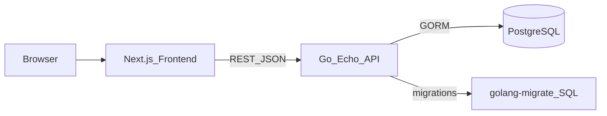
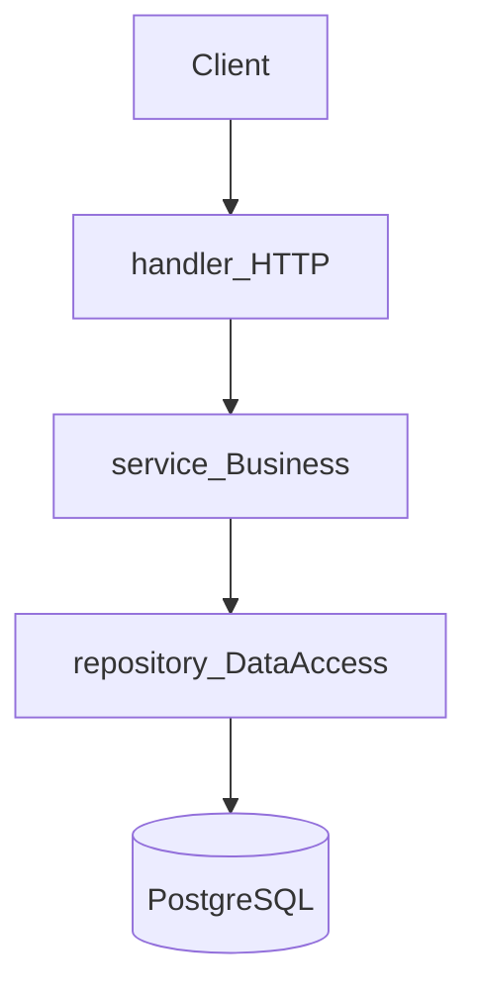
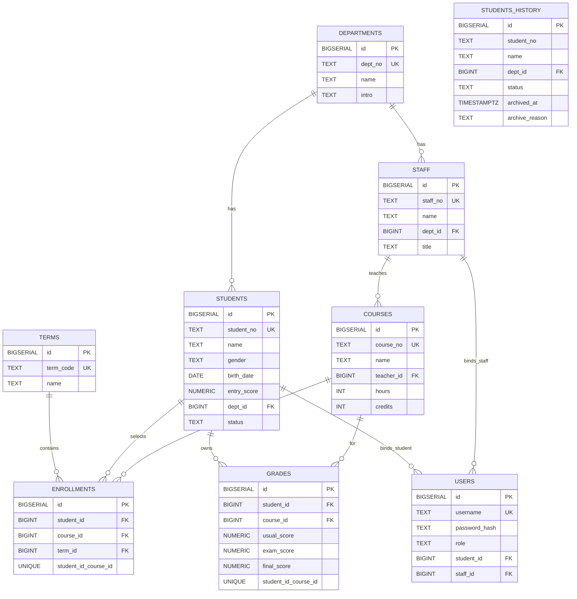
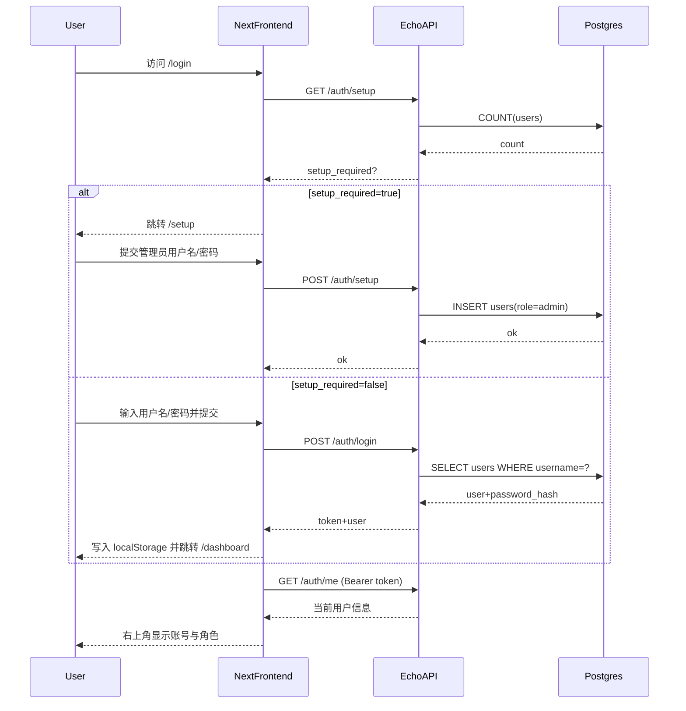
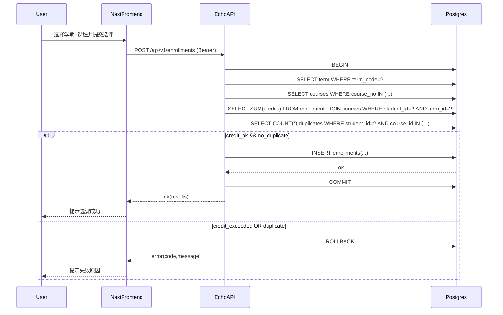
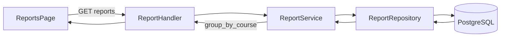

# EduMgr 教学管理系统（数据库课程设计）课设报告（第 4~5 章）

> 说明：本文档内容严格依据本仓库**实际实现**撰写（Next.js + Go/Echo + PostgreSQL + GORM + golang-migrate），并与 `PRD.md` / `ARCHITECTURE.md` / `Backend/migrations/*.sql` / 前后端源码保持一致。

---

## 4 总体设计方案

### 4.1 模块设计与分析

#### 4.1.1 总体架构（B/S 架构）

本系统采用典型的 **B/S（Browser/Server）架构**：

- **浏览器端（Frontend）**：负责页面渲染、表单交互、基础校验、JWT 存取、按角色展示菜单与入口。
- **服务端（Backend）**：提供 RESTful API，负责最终的权限裁决、业务规则校验、事务一致性处理、数据查询与统计计算。
- **数据库（PostgreSQL）**：负责数据持久化与约束（主键/外键/唯一/检查约束）、索引支撑查询性能。
- **迁移与初始化（golang-migrate）**：通过版本化 SQL 管理数据库结构与测试数据。

总体数据流如下（浏览器 -> 前端 -> 后端 -> DB）：

#### 4.1.2 前端模块划分（Next.js App Router）

前端基于 Next.js App Router 组织页面，核心模块集中在 `Frontend/app`：

- **认证模块**
  - `/login`：登录，获取 JWT 并写入 `localStorage`
  - `/setup`：首次初始化创建管理员（仅当系统无任何用户时可用）
- **管理面板模块**
  - `/dashboard`：概览页（根据角色显示不同统计信息与入口）
  - `/dashboard/departments`：系管理（管理员）
  - `/dashboard/students`：学生管理（管理员）
  - `/dashboard/staff`：教职工管理（管理员）
  - `/dashboard/courses`：课程管理（管理员写；全角色读）
  - `/dashboard/enrollments`：选课管理（管理员）
  - `/dashboard/grades`：成绩管理（管理员/教师）
  - `/dashboard/reports`：统计报表（管理员/教师）
  - `/dashboard/my-*`：学生端自助（课程选课/我的选课/我的成绩）

前端还包括：

- `Frontend/lib/api.ts`：统一 API 请求封装、TypeScript 类型定义、Token/User 本地存储。
- `Frontend/app/dashboard/_components/RoleBasedNav.tsx`：基于角色过滤导航入口（体验层）。
- `Frontend/app/dashboard/_components/DashboardNav.tsx`：右上角账号区域（账号查看、退出登录）。

#### 4.1.3 后端模块划分（Echo + 分层设计）

后端采用典型的 **Handler/Service/Repository/Model** 分层，目录位于 `Backend/internal`：

- **handler/**：HTTP 层（参数解析、请求体绑定、返回统一 JSON 结构）
- **service/**：业务层（选课学分校验、事务处理、权限细则、报表统计）
- **repository/**：数据访问层（基于 GORM + join 的复杂查询、分页、排序）
- **model/**：数据库模型（与迁移脚本表结构一致）
- **middleware/**：中间件（JWT 解析、RBAC 角色控制、写操作限制）

分层关系示意：

#### 4.1.4 权限与安全策略（JWT + RBAC + 写操作拦截）

系统实现了三类角色（与 `ARCHITECTURE.md` 对齐）：

- **admin（管理员）**：可执行所有操作（CRUD、选课管理、成绩管理、报表、用户管理等）。
- **teacher（教师）**：可查询业务数据；可对“本人任课课程”的成绩录入/修改；可查看报表。
- **student（学生）**：可选课、查看本人选课与成绩、查看本人信息；课程列表可读。

后端使用 **JWT** 进行认证，核心 claims 为：

- `user_id`：用户 ID
- `role`：角色（admin/teacher/student）

权限控制采用两层机制：

1. **RequireRole**：按路由限制允许访问的角色集合（例如报表只允许 admin/teacher）。
2. **WriteAdminOnly**：对同一组路由实行“读写分离”：
   - GET/HEAD/OPTIONS 放行（但仍需通过 RequireRole）
   - POST/PUT/PATCH/DELETE 仅允许 admin

此外，成绩录入存在更细粒度的权限校验：**teacher 只能修改自己任课课程的成绩**（业务层校验，不仅依赖路由拦截）。

---

### 4.2 关键数据结构

本节从“接口返回结构、认证信息、核心业务 DTO、前端类型与状态存储”四方面梳理关键数据结构。

#### 4.2.1 统一 API 返回结构

后端所有接口统一返回：

| 字段 | 类型 | 含义 |
| --- | --- | --- |
| code | int | 业务状态码（0 表示成功，非 0 表示失败） |
| message | string | 提示信息（成功为 `ok`） |
| data | any | 业务数据（成功时可选） |

该设计便于前端统一处理错误与提示，也便于后续扩展错误码体系。

#### 4.2.2 JWT Claims（认证关键结构）

JWT 中存放的核心结构：

| 字段 | 类型 | 含义 |
| --- | --- | --- |
| user_id | uint | 当前登录用户 ID |
| role | string | 角色：admin/teacher/student |
| exp/iat/sub | 标准字段 | 过期时间/签发时间/主体标识 |

后端中间件会解析 token，并将 Claims 放入请求上下文供后续 handler/service 使用。

#### 4.2.3 选课相关 DTO（EnrollRequest/EnrollResult）

选课支持两种模式（对齐 PRD：单个学生选多门、多个学生选同一/多门）：

**请求结构（EnrollRequest）**

| 字段 | 类型 | 含义 |
| --- | --- | --- |
| term_code | string | 学期代码，如 `2024-FALL` |
| student_no | string | 单个学生学号（管理员可用） |
| student_nos | string[] | 多个学生学号（管理员可用） |
| course_nos | string[] | 课程号列表 |

**响应结构（EnrollResult）**

| 字段 | 类型 | 含义 |
| --- | --- | --- |
| student_id | uint | 学生 ID |
| term_id | uint | 学期 ID |
| course_ids | uint[] | 成功选课的课程 ID 列表 |

#### 4.2.4 成绩查询与展示结构（按课程分组）

成绩查询结果按照“课程”为单位进行分组输出（对齐 PRD：多门课程按课程分组显示，每门课程内按总评降序）：

**CourseGradeGroup（课程分组）**

| 字段 | 类型 | 含义 |
| --- | --- | --- |
| course_no/course_name | string | 课程号/课程名 |
| teacher_no/teacher_name | string | 任课教师号/姓名 |
| hours/credits | int | 学时/学分 |
| class_time/class_location/exam_time | string | 上课时间/地点/考试时间 |
| dept_no | string | 院系号（学生所属系/用于条件筛选） |
| rows | GradeRow[] | 本课程的成绩行 |

**GradeRow（学生成绩行）**

| 字段 | 类型 | 含义 |
| --- | --- | --- |
| student_no/student_name | string | 学号/姓名 |
| gender | string | 性别 |
| usual_score/exam_score/final_score | number\|null | 平时/考试/总评（允许为空） |

#### 4.2.5 报表结构（登记表/成绩报表 + 分段统计）

报表按课程输出，每个课程包含学生名单（登记表可为空成绩；成绩报表包含成绩与分段统计）。

**RosterCourse（课程报表单元）**

| 字段 | 类型 | 含义 |
| --- | --- | --- |
| course_no/course_name | string | 课程号/课程名 |
| teacher_no/teacher_name | string | 教师号/姓名 |
| hours/credits | int | 学时/学分 |
| class_time/class_location/exam_time | string | 上课时间/地点/考试时间 |
| students | RosterStudent[] | 学生行（按学号升序） |
| dist | ScoreDist\|null | 分段统计（仅成绩报表有） |

**ScoreDist（成绩分布统计）**

| 字段 | 含义 |
| --- | --- |
| ge90_count/ge90_rate | ≥90 人数与比例 |
| ge80_count/ge80_rate | ≥80 人数与比例 |
| ge70_count/ge70_rate | ≥70 人数与比例 |
| ge60_count/ge60_rate | ≥60 人数与比例 |
| lt60_count/lt60_rate | <60 人数与比例 |

#### 4.2.6 前端 TypeScript 关键类型与本地存储

前端在 `Frontend/lib/api.ts` 定义了与后端响应对齐的类型，包括：

- `User`（含 role、可选 student_id/staff_id）
- `Department/Student/Staff/Course/Term/Enrollment`
- `CourseGradeGroup/GradeRow`（成绩分组）

本地状态存储策略：

- `localStorage.edumgr_token`：保存 JWT
- `localStorage.edumgr_user`：保存当前用户（username/role/绑定 ID）

并提供 `apiFetch()` 统一在请求头自动追加 `Authorization: Bearer <token>`，遇到 401 自动清理 token。

---

### 4.3 数据库分析与设计

#### 4.3.1 设计目标与原则

数据库设计目标：

- 覆盖核心业务对象：院系、学生、教职工、课程、学期、选课、成绩、用户账号
- 满足 PRD 的关键约束：唯一性约束、选课学分上限、删除选课同步处理成绩、报表统计输出等
- 通过约束 + 索引保证数据一致性与查询性能

#### 4.3.2 实体关系（ER 图）

数据库实体关系如下（以迁移脚本为准）：

> 关键说明：`enrollments` 与 `grades` 的唯一约束均为 `UNIQUE(student_id, course_id)`，与本课设的实现假设一致：**同一学生同一课程最多修读一次**；学期主要用于选课学分上限与展示/统计。

#### 4.3.3 表结构与约束设计（真实表）

以下表结构来自 `Backend/migrations/000001_init.up.sql`（字段、类型、约束与索引均为真实实现）。

##### （1）`departments` 院系表

| 字段 | 类型 | 约束 | 说明 |
| --- | --- | --- | --- |
| id | BIGSERIAL | PK | 主键 |
| dept_no | TEXT | UNIQUE, NOT NULL | 系号（业务唯一标识） |
| name | TEXT | NOT NULL | 系名称 |
| intro | TEXT | NOT NULL, DEFAULT '' | 系简介 |
| created_at/updated_at | TIMESTAMPTZ | DEFAULT now() | 创建/更新时间 |

##### （2）`students` 学生表

| 字段 | 类型 | 约束 | 说明 |
| --- | --- | --- | --- |
| id | BIGSERIAL | PK | 主键 |
| student_no | TEXT | UNIQUE, NOT NULL | 学号（唯一） |
| name | TEXT | NOT NULL | 姓名 |
| gender | TEXT | DEFAULT '' | 性别 |
| birth_date | DATE | 可空 | 出生日期 |
| entry_score | NUMERIC(6,2) | 可空 | 入学成绩 |
| dept_id | BIGINT | FK -> departments(id), NOT NULL | 所属院系 |
| status | TEXT | DEFAULT 'in_school' | 学籍状态（在读/毕业/转出/转入等） |
| created_at/updated_at | TIMESTAMPTZ | DEFAULT now() | 创建/更新时间 |

索引：`idx_students_dept_id (students.dept_id)`（支持按院系查询）。

##### （3）`students_history` 学生历史归档表

| 字段 | 类型 | 约束 | 说明 |
| --- | --- | --- | --- |
| id | BIGSERIAL | PK | 主键 |
| student_no | TEXT | NOT NULL | 学号（归档保留） |
| name | TEXT | NOT NULL | 姓名 |
| gender | TEXT | DEFAULT '' | 性别 |
| birth_date | DATE | 可空 | 出生日期 |
| entry_score | NUMERIC(6,2) | 可空 | 入学成绩 |
| dept_id | BIGINT | FK -> departments(id), NOT NULL | 原院系 |
| status | TEXT | NOT NULL | 归档后的状态值 |
| archived_at | TIMESTAMPTZ | DEFAULT now() | 归档时间 |
| archive_reason | TEXT | NOT NULL | 归档原因（graduate/transfer_out） |

该表用于满足“毕业/转学历史数据存储”的需求，并配合业务事务实现数据一致性。

##### （4）`staff` 教职工表

| 字段 | 类型 | 约束 | 说明 |
| --- | --- | --- | --- |
| id | BIGSERIAL | PK | 主键 |
| staff_no | TEXT | UNIQUE, NOT NULL | 职工号（唯一） |
| name | TEXT | NOT NULL | 姓名 |
| gender | TEXT | DEFAULT '' | 性别 |
| birth_month | TEXT | DEFAULT '' | 出生年月（字符串形式） |
| dept_id | BIGINT | FK -> departments(id), NOT NULL | 所属院系 |
| title | TEXT | DEFAULT '' | 职称 |
| major | TEXT | DEFAULT '' | 专业 |
| teaching_direction | TEXT | DEFAULT '' | 教学方向 |
| created_at/updated_at | TIMESTAMPTZ | DEFAULT now() | 创建/更新时间 |

索引：`idx_staff_dept_id (staff.dept_id)`。

##### （5）`courses` 课程表

| 字段 | 类型 | 约束 | 说明 |
| --- | --- | --- | --- |
| id | BIGSERIAL | PK | 主键 |
| course_no | TEXT | UNIQUE, NOT NULL | 课程号（唯一） |
| name | TEXT | NOT NULL | 课程名称 |
| teacher_id | BIGINT | FK -> staff(id), NOT NULL | 任课教师（绑定教师） |
| hours | INT | DEFAULT 0 | 学时 |
| credits | INT | DEFAULT 0 | 学分 |
| class_time | TEXT | DEFAULT '' | 上课时间 |
| class_location | TEXT | DEFAULT '' | 上课地点 |
| exam_time | TEXT | DEFAULT '' | 考试时间 |
| created_at/updated_at | TIMESTAMPTZ | DEFAULT now() | 创建/更新时间 |

索引：`idx_courses_teacher_id (courses.teacher_id)`（支持按教师关联查询）。

##### （6）`terms` 学期表

| 字段 | 类型 | 约束 | 说明 |
| --- | --- | --- | --- |
| id | BIGSERIAL | PK | 主键 |
| term_code | TEXT | UNIQUE, NOT NULL | 学期代码（如 2024-FALL） |
| name | TEXT | NOT NULL | 学期名称 |
| start_date/end_date | DATE | 可空 | 起止日期 |
| created_at/updated_at | TIMESTAMPTZ | DEFAULT now() | 创建/更新时间 |

##### （7）`enrollments` 选课表（学生-课程-学期）

| 字段 | 类型 | 约束 | 说明 |
| --- | --- | --- | --- |
| id | BIGSERIAL | PK | 主键 |
| student_id | BIGINT | FK -> students(id), NOT NULL | 学生 |
| course_id | BIGINT | FK -> courses(id), NOT NULL | 课程 |
| term_id | BIGINT | FK -> terms(id), NOT NULL | 学期 |
| created_at | TIMESTAMPTZ | DEFAULT now() | 选课时间 |
| UNIQUE(student_id, course_id) | 唯一约束 |  | 防止重复选课（同课只修一次） |

索引：`idx_enrollments_term_id`、`idx_enrollments_student_id`。

##### （8）`grades` 成绩表

| 字段 | 类型 | 约束 | 说明 |
| --- | --- | --- | --- |
| id | BIGSERIAL | PK | 主键 |
| student_id | BIGINT | FK -> students(id), NOT NULL | 学生 |
| course_id | BIGINT | FK -> courses(id), NOT NULL | 课程 |
| usual_score | NUMERIC(5,2) | CHECK 0~100 或 NULL | 平时成绩 |
| exam_score | NUMERIC(5,2) | CHECK 0~100 或 NULL | 考试成绩 |
| final_score | NUMERIC(5,2) | CHECK 0~100 或 NULL | 总评成绩 |
| updated_at | TIMESTAMPTZ | DEFAULT now() | 更新时间 |
| UNIQUE(student_id, course_id) | 唯一约束 |  | 同一学生同一课程唯一成绩记录 |

索引：`idx_grades_course_id (grades.course_id)`。

##### （9）`users` 登录用户表

| 字段 | 类型 | 约束 | 说明 |
| --- | --- | --- | --- |
| id | BIGSERIAL | PK | 主键 |
| username | TEXT | UNIQUE, NOT NULL | 登录名 |
| password_hash | TEXT | NOT NULL | bcrypt 密码哈希 |
| role | TEXT | NOT NULL | 角色：admin/teacher/student |
| student_id | BIGINT | FK -> students(id), 可空 | 绑定学生身份（学生账号） |
| staff_id | BIGINT | FK -> staff(id), 可空 | 绑定教职工身份（教师账号） |
| created_at/updated_at | TIMESTAMPTZ | DEFAULT now() | 创建/更新时间 |

#### 4.3.4 关键设计点总结

- **唯一性与完整性**
  - `dept_no/student_no/staff_no/course_no/username` 全部唯一
  - 选课与成绩采用 `UNIQUE(student_id, course_id)` 防止重复
- **分数合法性**
  - `grades` 对三类分数设置 0~100 的 CHECK 约束（可空）
- **查询与统计性能**
  - 对高频过滤/关联字段建立索引（如 `students.dept_id`、`courses.teacher_id` 等）
- **与 PRD 对齐的业务约束落地**
  - “每学期 ≤15 学分”由后端事务校验实现（数据库不直接表达该跨行/跨表约束）
  - “删除选课同步处理成绩”在事务中显式删除成绩记录
  - 报表按“教师所在系”筛选：通过 join `teacher_dept` 实现

---

## 5 系统实现与分析

> 本章按“页面/功能模块”组织，并给出对应的后端接口、权限、关键流程与实现要点。

### 5.1 登录 / 初始化 / 账号查看

#### 5.1.1 功能概述

- **登录**：用户输入用户名密码，后端校验通过后签发 JWT。
- **初始化**：当系统内 `users` 表为空时，允许通过初始化页面创建首个管理员账号。
- **账号查看**：进入 Dashboard 后，右上角展示当前 `username` 与 `role`，并支持退出登录。

#### 5.1.2 后端接口与流程

- `GET /auth/setup`：查询是否需要初始化（当用户数量为 0 时 `setup_required=true`）
- `POST /auth/setup`：创建初始管理员账号（只允许第一次执行）
- `POST /auth/login`：登录，返回 `{token, user}`
- `GET /auth/me`：根据 Authorization Header 中的 Bearer Token 返回当前用户信息

#### 5.1.3 前端实现要点

- 登录成功后写入：
  - `localStorage.edumgr_token = token`
  - `localStorage.edumgr_user = user`
- Dashboard 顶部组件会异步调用 `/auth/me` 刷新用户信息，从而实现“账号查看/展示角色标签”。
- 若 API 返回 401，前端统一清理 token 并跳转登录页，避免无效 token 引起异常状态。

#### 5.1.4 登录与初始化时序图

---

### 5.2 系管理（管理员）

#### 5.2.1 功能概述

系管理用于维护院系基础信息（系号、名称、简介），并作为学生、教职工等实体的外键来源。

#### 5.2.2 权限控制

- 后端：读接口允许 **admin/teacher**（便于教师进行查询查看）
- 写接口（新增/修改/删除）仅允许 **admin**（通过 `WriteAdminOnly` 强制）

#### 5.2.3 实现要点

- 数据库层面：`departments.dept_no` UNIQUE，防止重复系号。
- 删除策略：删除系信息前，需要保证没有关联学生/教职工/课程（该规则在业务层校验，避免破坏引用完整性）。
- 前端页面：提供列表展示、表单编辑与删除操作（写操作需管理员权限）。

---

### 5.3 学生管理（管理员）与学生自助信息（学生）

#### 5.3.1 功能概述

学生模块覆盖：

- 学生信息 CRUD（管理员）
- 学籍异动：毕业、转出、转入（管理员）
- 学生自助查看本人信息（学生）

#### 5.3.2 权限控制

- 管理员：可对学生执行增删改查与学籍异动。
- 学生：仅可通过“我的信息”接口查看本人信息。

#### 5.3.3 学籍异动（毕业/转出）事务处理

为了满足“历史数据存储”的需求，系统在毕业/转出时采用事务策略：

1. 将学生当前信息写入 `students_history`（带 `archived_at` 和 `archive_reason`）
2. 更新 `students.status`（如 `graduated` / `transfer_out`）

该两步在同一事务中完成，保证历史归档与状态变化的一致性。

---

### 5.4 教职工管理（管理员）

#### 5.4.1 功能概述

教职工模块用于维护教师（及相关教职工）信息，包括职工号、姓名、所属院系、职称、专业、教学方向等。

#### 5.4.2 关键约束与校验

- `staff.staff_no` 唯一，保证职工号不重复。
- 删除教师前需要校验：该教师是否仍承担课程（课程表 `courses.teacher_id` 的引用关系）。
  - 若仍承担课程，则禁止删除，避免出现“课程任课教师缺失”的不一致数据。

---

### 5.5 课程管理（管理员写；全角色可读）

#### 5.5.1 功能概述

课程模块维护课程基本信息（课程号、课程名、学时、学分、上课时间地点、考试时间）及任课教师绑定。

#### 5.5.2 权限控制

- 全角色可读：`GET /api/v1/courses`（用于学生选课页面读取课程列表）
- 仅管理员可写：`POST/PUT/DELETE /api/v1/courses/*`

#### 5.5.3 实现要点

- `courses.course_no` 唯一，保证课程号不重复。
- `courses.teacher_id` 外键引用 staff，确保课程必须绑定任课教师。

---

### 5.6 学期管理（全角色可读）

#### 5.6.1 功能概述

学期模块提供学期基础信息（学期代码、名称、起止日期），用于：

- 选课行为的归属（enrollments.term_id）
- “每学期总学分 ≤ 15”约束的计算范围
- 学生端“我的选课/我的成绩”的展示维度

#### 5.6.2 实现要点

- `terms.term_code` UNIQUE（如 `2024-FALL`）。
- 学期列表开放给所有已登录用户读取，便于学生进行选课。

---

### 5.7 选课管理（管理员/学生）

#### 5.7.1 功能概述

选课模块实现：

- 管理员为一个/多个学生选课
- 学生为自己选课
- 查询选课列表（管理员/教师）与学生查看“我的选课”
- 退课（管理员/学生），并满足 PRD：**删除选课记录时需同步处理成绩数据**

#### 5.7.2 关键业务规则：每学期选课总学分 ≤ 15

后端在写入选课记录前执行事务校验：

1. 根据 `term_code` 找到学期
2. 根据 `course_nos` 找到课程与学分
3. 计算该学生在该学期已选课程学分总和
4. 判断 `currentCredits + addCredits <= 15`，否则拒绝
5. 校验是否重复选课（与 `UNIQUE(student_id, course_id)` 共同防护）
6. 写入 `enrollments`

该流程在数据库事务中完成，保证并发场景下的一致性。

#### 5.7.3 删除选课同步处理成绩（事务）

退课时，在同一事务中：

1. 删除 `grades` 中对应 `(student_id, course_id)` 的成绩记录（若存在）
2. 删除 `enrollments` 记录

保证“选课与成绩”不会出现孤儿数据。

#### 5.7.4 选课时序图（含学分校验）

---

### 5.8 成绩管理（管理员/教师）与成绩查询（全角色）

#### 5.8.1 功能概述

成绩模块实现：

- **成绩查询（全角色）**：支持按学生/课程/教师/系等条件查询，并按课程分组输出
- **成绩录入/修改（admin/teacher）**：
  - 按课程批量录入：`PUT /grades/by-course`
  - 按学生录入：`PUT /grades/by-student`
- **学生自助查看我的成绩**：`GET /grades/my`

#### 5.8.2 教师权限细化：只能操作自己课程成绩

虽然路由层允许 teacher 访问成绩写接口，但业务层仍会做“任课教师校验”：

- 通过登录用户绑定的 `staff_id` 找到教师身份
- 根据 `course_no` 找到课程并验证 `courses.teacher_id == staff_id`
- 不满足则返回 forbidden

该设计防止教师越权修改他人课程成绩。

#### 5.8.3 成绩查询分组与排序实现

成绩查询满足 PRD 的输出规则：

- **按课程分组**：后端将查询结果按 `course_no` 聚合为 `CourseGradeGroup`
- **组内排序**：SQL 层排序为 `final_score desc NULLS LAST`，并在必要时用 `student_no asc` 保持稳定输出

---

### 5.9 统计报表（管理员/教师）

#### 5.9.1 功能概述

系统提供两类报表（与 PRD 对齐）：

1. **成绩登记表**：输出课程信息 + 选课学生名单 + 空成绩栏（用于登记）
2. **成绩报表**：在登记表基础上增加平时/考试/总评，并统计分数段（≥90/≥80/≥70/≥60/不及格）人数与比例

支持筛选维度：

- 按课程号 / 课程名 / 教师姓名
- 按系号输出“**本系所有教师担任的课程**”（实现为对教师所属院系进行 join 过滤）

#### 5.9.2 报表生成数据流

#### 5.9.3 分段统计计算方式

成绩报表在服务层对每门课程的学生成绩 `final_score` 进行分段计数：

- ≥90
- 80~89
- 70~79
- 60~69
- <60

并以 `人数 / 有效成绩人数(total)` 计算比例（若该课程无有效成绩，则统计值置 0）。

---

### 5.10 用户管理（管理员）

#### 5.10.1 功能概述

用户管理用于维护登录账号（username/password/role）及其与学生/教职工实体的绑定关系：

- 创建用户（可选绑定 student_id 或 staff_id）
- 更新用户信息与角色
- 删除用户
- 重置密码（bcrypt 哈希保存）

#### 5.10.2 权限控制

用户管理接口在后端严格限制为 **admin 专属**（路由组只允许 admin）。

#### 5.10.3 与业务实体的绑定设计

`users` 表通过可空外键实现绑定：

- 学生账号：`student_id` 非空，`staff_id` 为空
- 教师账号：`staff_id` 非空，`student_id` 为空
- 管理员账号：两者均可为空（仅作为系统管理身份）

该设计使得“权限身份（role）”与“业务实体（student/staff）”既可关联又可解耦，便于后续扩展更多角色或更复杂的身份体系。

---

（第 4~5 章完）